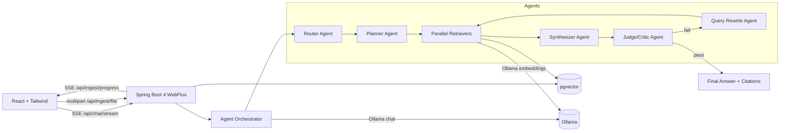
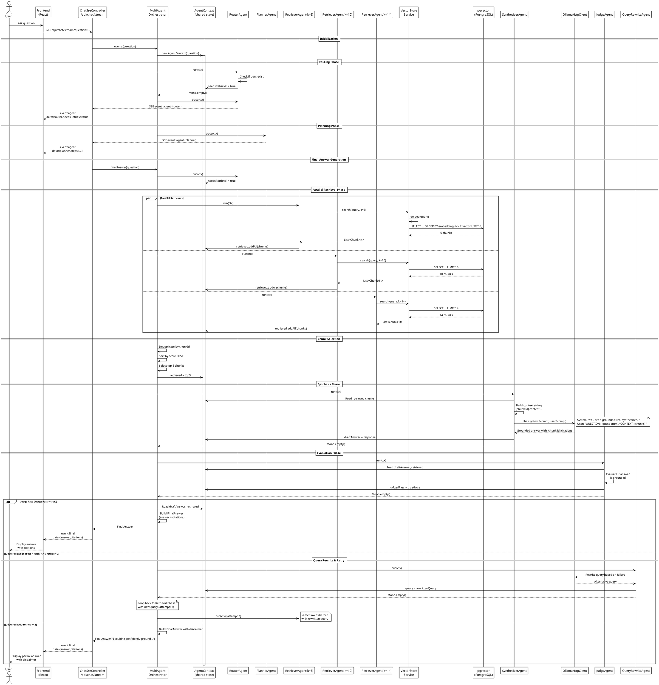

# RAG Agent Orchestrator

A **fully local, multi-agent Retrieval-Augmented Generation (RAG) system** built with **Spring Boot 4** and **Java 25**.
It features explicit agent orchestration, **SSE-based agent observability**, **document versioning**, and **re-embedding strategies**.

## Key capabilities
- **Multi-agent architecture**: router, planner, retriever(s), synthesizer, judge/critic, query-rewriter
- **Orchestration loops**: judge → rewrite → retrieve → answer (bounded retries)
- **Parallel agent execution**: multiple retrievers run concurrently and the orchestrator aggregates results
- **SSE streaming**:
  - Chat + agent trace: `GET /api/chat/stream?question=...`
  - Ingestion progress: `GET /api/ingest/progress?jobId=...`
- **Local-only AI**: Ollama chat + embedding models (no external APIs)
- **pgvector**: PostgreSQL vector search with cosine distance
- **Document versioning**: stable `logicalId`, monotonic `version`, `is_latest` flag
- **Re-embedding**: recompute embeddings for latest or all docs

## Architecture Overview



## Multi-Agent System

The orchestrator implements an **explicit agent coordination pattern** where specialized agents collaborate through a shared mutable context (`AgentContext`). Each agent has a specific responsibility and communicates by reading from and writing to this shared state.

### Agent Roles

#### 1. **RouterAgent**
- **Purpose**: Determines if the question requires document retrieval or can be answered directly
- **Input**: User's question
- **Output**: Sets `ctx.needsRetrieval` flag (true/false)
- **Logic**: Simple heuristic - if documents exist in the system, always prefer retrieval for grounded answers
- **Implementation**: `RouterAgent.java`

#### 2. **PlannerAgent**
- **Purpose**: Defines the execution plan for processing the query
- **Input**: Current context state
- **Output**: Emits planning metadata as SSE events for observability
- **Phases**: route → parallel retrieve → synthesize → judge → retry (if needed)
- **Implementation**: `PlannerAgent.java`

#### 3. **RetrieverAgent** (3 parallel instances)
- **Purpose**: Fetches relevant document chunks from pgvector using semantic similarity
- **Input**: Query string (original or rewritten), top-k parameter
- **Output**: Populates `ctx.retrieved` with `ChunkHit` objects
- **Parallel Execution**: Three instances run concurrently with different k values:
  - RetrieverAgent("a", k=6)
  - RetrieverAgent("b", k=10)
  - RetrieverAgent("c", k=14)
- **Aggregation**: All results are merged, deduplicated by chunkId, and re-ranked by score
- **Final Selection**: Top 3 highest-scoring unique chunks are passed to synthesizer
- **Implementation**: `RetrieverAgent.java`

#### 4. **SynthesizerAgent**
- **Purpose**: Generates a grounded answer using only the retrieved context
- **Input**: Top-ranked chunks from `ctx.retrieved`, user question
- **Output**: Sets `ctx.draftAnswer` with citation-annotated response
- **LLM**: Direct Ollama HTTP API call (bypasses Spring AI)
- **Grounding Rule**: Must cite every statement with `[chunk:id]` format; cannot use outside knowledge
- **System Prompt**: Defined in `Agent.java:48-67`
- **Implementation**: `SynthesizerAgent.java`

#### 5. **JudgeAgent**
- **Purpose**: Evaluates if the synthesized answer is adequately grounded in retrieved context
- **Input**: `ctx.draftAnswer`, `ctx.retrieved`
- **Output**: Sets `ctx.judgedPass` (true if answer is acceptable, false otherwise)
- **Logic**: Simple rule-based heuristic (checks if answer is non-empty and has citations)
- **No LLM**: Lightweight evaluation without AI overhead
- **Implementation**: `JudgeAgent.java`

#### 6. **QueryRewriteAgent**
- **Purpose**: Rewrites the query to improve retrieval on subsequent attempts
- **Input**: Original question, failed draft answer, retrieved chunks
- **Output**: Updates `ctx.query` with reformulated question
- **LLM**: Ollama API call to generate alternative phrasing
- **Trigger**: Only invoked when `ctx.judgedPass = false` and retries < 2
- **Implementation**: `QueryRewriteAgent.java`

### Agent Interaction Flow

**AgentContext** (shared mutable state):
```java
class AgentContext {
  final String question;        // Original user question (immutable)
  String query;                 // Current query (may be rewritten)
  boolean needsRetrieval;       // Router decision
  List<ChunkHit> retrieved;     // Chunks from retrievers (thread-safe)
  String draftAnswer;           // Synthesizer output
  boolean judgedPass;           // Judge evaluation
  List<Citation> citations;     // Final citations
}
```

**Execution Flow**:

1. **Routing Phase**
   - RouterAgent reads `ctx.question`
   - Sets `ctx.needsRetrieval = true` if documents exist

2. **Retrieval Phase** (if needed)
   - Three RetrieverAgents run in parallel (Flux.flatMap concurrency=3)
   - Each queries pgvector with different k values
   - Results merged into `ctx.retrieved`
   - Top 3 chunks selected by score

3. **Synthesis Phase**
   - SynthesizerAgent reads `ctx.retrieved` and `ctx.question`
   - Builds context string: `[chunk:id] content\n\n...`
   - Calls Ollama with grounding system prompt
   - Writes response to `ctx.draftAnswer`

4. **Evaluation Phase**
   - JudgeAgent reads `ctx.draftAnswer` and `ctx.retrieved`
   - Sets `ctx.judgedPass = true/false`

5. **Retry Loop** (max 2 attempts)
   - If `ctx.judgedPass = false` and `attempt < 2`:
     - QueryRewriteAgent rewrites `ctx.query`
     - Loop back to step 2 with new query
   - Else: return final answer (possibly with disclaimer)

**Key Design Principles**:
- **Explicit coordination**: No implicit agent discovery; orchestrator controls execution order
- **Reactive composition**: All agents return `Mono<Void>`, side-effects via context mutation
- **Thread-safety**: `ctx.retrieved` and `ctx.citations` use `Collections.synchronizedList()`
- **Lazy evaluation**: `Mono.defer()` ensures context is read at subscription time, not call time
- **Observability**: Each agent emits SSE trace events for real-time monitoring

## Sequence Diagram

The following PlantUML diagram shows the complete data flow for a chat query with retrieval:



### Retry Mechanism

The orchestrator implements a **bounded retry loop** with the following characteristics:

- **Max retries**: 2 attempts total (initial + 1 retry)
- **Trigger**: `judgedPass = false` (answer not adequately grounded)
- **Action**: QueryRewriteAgent reformulates the query
- **Loop**: Return to retrieval phase with rewritten query
- **Fallback**: After max retries, return answer with disclaimer:
  > "I couldn't confidently ground a complete answer from the retrieved context."

### Thread Safety

All agents operate in a **reactive, concurrent environment** using Project Reactor:

- `ctx.retrieved` and `ctx.citations` are wrapped with `Collections.synchronizedList()`
- Agent logic is wrapped in `Mono.defer()` for lazy evaluation at subscription time
- Parallel retrievers use `Flux.flatMap(agent -> agent.run(ctx), concurrency=3)`
- Context mutations are safe because agents execute sequentially within each attempt

### Why Direct Ollama Integration?

The system bypasses **Spring AI ChatClient** in favor of direct HTTP calls to Ollama:

- **Reason**: Spring AI 2.0.0-M1 (milestone) has integration bugs that drop context
- **Evidence**: Same prompts work via curl but fail through Spring AI ChatClient
- **Solution**: `OllamaHttpClient.java` implements direct HTTP POST to `/api/chat`
- **Benefits**: Full control, detailed logging, proven reliability

## Quick start

### 1) Start Postgres (pgvector)
```bash
cd docker
docker compose up -d
```

### 2) Pull Ollama models
```bash
ollama pull llama3.2
ollama pull nomic-embed-text
```

### 3) Run backend (Gradle 9)
```bash
cd backend
./gradlew bootRun
```

### 4) Ingest docs (UI upload OR CLI)
- UI: open http://localhost:5173 and upload a file
- CLI:
```bash
cd backend
./gradlew ingestFolder --args="../sample_docs"
```

### 5) Run frontend
```bash
cd frontend
npm install
npm run dev
```

UI: http://localhost:5173  
Backend health: http://localhost:8080/health

## Ingestion API
- `POST /api/ingest/file` (multipart) → returns `{jobId}`
- `GET /api/ingest/progress?jobId=...` (SSE) → progress events
- `POST /api/ingest/reembed` → `{ "scope": "latest|all", "model": "optional" }`

## Chat API
- `GET /api/chat/stream?question=...` (SSE) → `event: agent` + `event: final`
