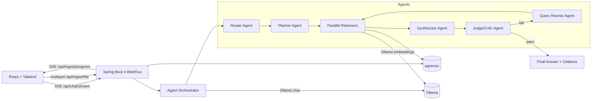

# RAG Agent Orchestrator

A **fully local, multi-agent Retrieval-Augmented Generation (RAG) system** built with **Spring Boot 4** and **Java 25**.
It features explicit agent orchestration, **SSE-based agent observability**, **document versioning**, and **re-embedding strategies**.

## Key capabilities
- **Multi-agent architecture**: router, planner, retriever(s), synthesizer, judge/critic, query-rewriter
- **Orchestration loops**: judge → rewrite → retrieve → answer (bounded retries)
- **Parallel agent execution**: multiple retrievers run concurrently and the orchestrator aggregates results
- **SSE streaming**:
  - Chat + agent trace: `GET /api/chat/stream?question=...`
  - Ingestion progress: `GET /api/ingest/progress?jobId=...`
- **Local-only AI**: Ollama chat + embedding models (no external APIs)
- **pgvector**: PostgreSQL vector search with cosine distance
- **Document versioning**: stable `logicalId`, monotonic `version`, `is_latest` flag
- **Re-embedding**: recompute embeddings for latest or all docs

## Architecture (agents + flow)



## Quick start

### 1) Start Postgres (pgvector)
```bash
cd docker
docker compose up -d
```

### 2) Pull Ollama models
```bash
ollama pull llama3.2
ollama pull nomic-embed-text
```

### 3) Run backend (Gradle 9)
```bash
cd backend
./gradlew bootRun
```

### 4) Ingest docs (UI upload OR CLI)
- UI: open http://localhost:5173 and upload a file
- CLI:
```bash
cd backend
./gradlew ingestFolder --args="../sample_docs"
```

### 5) Run frontend
```bash
cd frontend
npm install
npm run dev
```

UI: http://localhost:5173  
Backend health: http://localhost:8080/health

## Ingestion API
- `POST /api/ingest/file` (multipart) → returns `{jobId}`
- `GET /api/ingest/progress?jobId=...` (SSE) → progress events
- `POST /api/ingest/reembed` → `{ "scope": "latest|all", "model": "optional" }`

## Chat API
- `GET /api/chat/stream?question=...` (SSE) → `event: agent` + `event: final`
